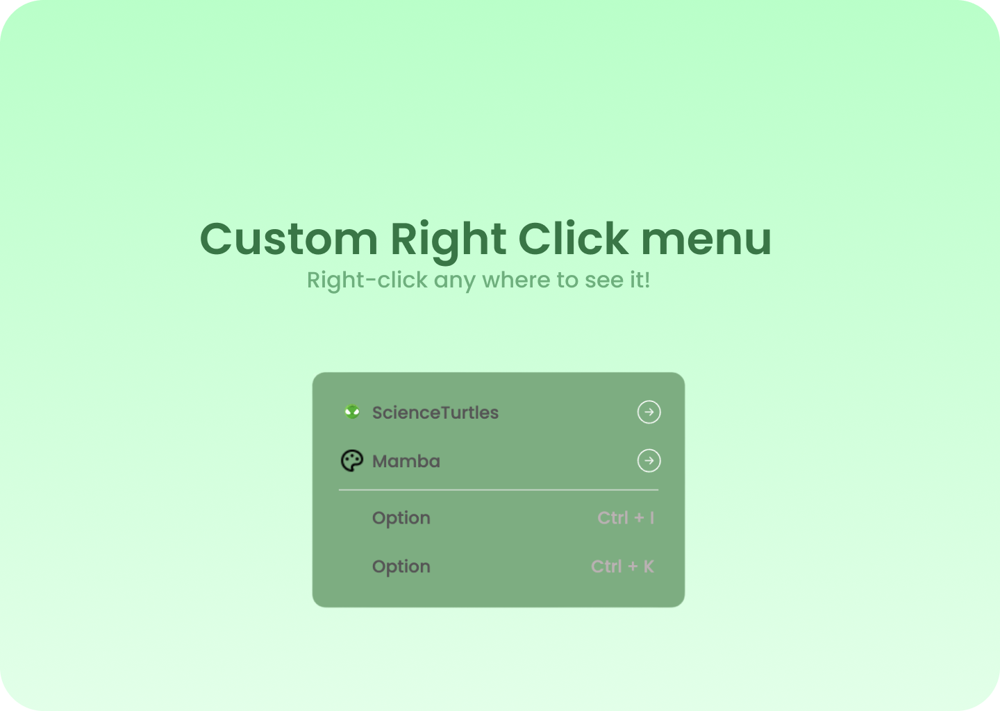

# Features
<ul>
<li> Easy to customise - You can select colors, edit the options directly from the css/html root easy! </li>
<li> Modern design - The contextmenu i made has a modern and pretty design
</li>
<li> Easy to use
</li> 
<li> ...and we offer support for ti! - this means that you can contact us on discord or on our website to get help with the problem you have with this repo!
</li>
</ul>

<h1> How to use it?</h1>

To use the context-menu and customise it, you have to modify the options. The code comes with some examples you can use: 

<pre>
    It uses anchor tags(<a>) in order to make it easier to work. 
        - The anchor tag contains: - href rule, you can use it for redirects
                                   - onclick: here you can make a function in cmenu.min.js and execute it by putting it on the onclick rule!
                                   - the img tags: first one is the img that it's displayed in the left, the second one is the img tag containing the svg for the redirect option
    
</pre>

